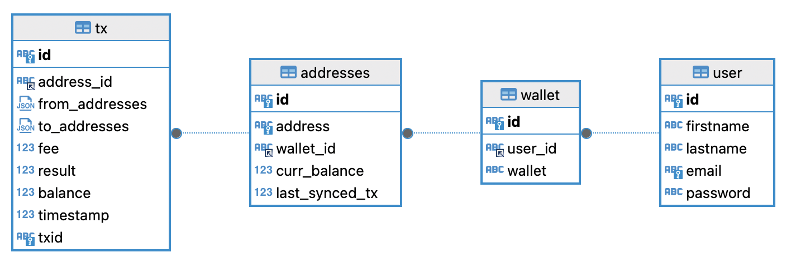

### Objectives

- Created an app to simulate wallet btc wallet synchronization.
- User can import a btc address to the wallet
- The app then tries to sync the transactions, final_balance etc for the addresses imported for the wallet
- Used the blockchain.info api to get the blockchain data

### Limitations and Assumptions

- Since the apis support only by offset and count and not by timestamps or any other mechanism, I start syncing the trasactions from the last transaction by paginating the api based on offset.

```
GET https://blockchain.info/rawaddr/12xQ9k5ousS8MqNsMBqHKtjAtCuKezm2Ju?offset=50
```
- There is a limit on the api so only upto 5000 tc can be synced:
```sh
[2025-03-08 22:28:28,003: WARNING/ForkPoolWorker-2] API call failed: Error 400 for https://blockchain.info/rawaddr/bc1qm34lsc65zpw79lxes69zkqmk6ee3ewf0j77s3h: {"error":"user-error","message":"offset exceeded: 1712200 > 50000"}
```

- I use a celery task triggered every 2 minutes to run the syncing of all the addresses which need syncing 

- We find the diff between the  total transactions count (n_tx) returned from the api below and the last sync job run
also to deal with conflicting transactions due to different count of items in a page i use timestamp to make sure no conflicts happen in the transactions table

```sh
GET https://blockchain.info/multiaddr?active=3E8ociqZa9mZUSwGdSmAEMAoAxBK3FNDcd|bc1qm34lsc65zpw79lxes69zkqmk6ee3ewf0j77s3h
```

- Since running multiple celery tasks could cause rate limiting i decided to create a lock on redis which would make sure only one sync job runs at a time


### How to run the code 

- Prerequisite download and install docker and make 
- clone the repo
- go inside the directory ```mybtcwallet```

```sh
cd mybtcwallet
```

- run the ```make run``` command to start docker compose command 

```sh
make run
```

- if the previous command does not run then you might have docker engine and not docker desktop so run ```docker-compose up```

- once the app is running the flask endpoints will be ready to play with 
- the database is seeded with a fake user and wallet and two btc addresses in the wallet

```sh 
curl --location 'http://localhost:8000/api/wallet'
```

```sh
[
  {
    "id": "dbe6913a-7192-49be-b5bf-f6bc4917a2b6",
    "user_id": "57f8832a-f4c1-4cc9-a723-b67ef0466e3d",
    "wallet": "btc_wallet_001"
  }
]
```

- Then use the wallet id from above to get the addresses registered for the wallet

```sh
curl --location 'http://localhost:8000/api/address/dbe6913a-7192-49be-b5bf-f6bc4917a2b6'
```


```sh
[
  {
    "address": "bc1q0sg9rdst255gtldsmcf8rk0764avqy2h2ksqs5",
    "curr_balance": 0.0,
    "id": "43aed8d8-24db-45d5-82bc-caffdcf86177",
    "last_synced_tx": 2,
    "status": "synced",
    "wallet_id": "dbe6913a-7192-49be-b5bf-f6bc4917a2b6"
  },
  {
    "address": "12xQ9k5ousS8MqNsMBqHKtjAtCuKezm2Ju",
    "curr_balance": 0.0,
    "id": "a441dda4-375f-4bb1-adf9-7a1e434765a5",
    "last_synced_tx": 392,
    "status": "syncing",
    "wallet_id": "dbe6913a-7192-49be-b5bf-f6bc4917a2b6"
  }
]
```

- **notice** the btc address with less transactions has status synced while the one with more transactions is still syncing but the ucurr_balance is uptdate for both adresses

- use the address id from above to see the trasnactions associated with the address which we synced from the api 
- this api is paginated for not overloading the db while querying

```sh
curl --location 'http://localhost:8000/api/transactions/43aed8d8-24db-45d5-82bc-caffdcf86177?page=1&per_page=5'
```

```sh
{
  "current_page": 1,
  "pages": 1,
  "per_page": 5,
  "total": 2,
  "transactions": [
    {
      "address_id": "43aed8d8-24db-45d5-82bc-caffdcf86177",
      "balance": 0.0,
      "fee": 429.0,
      "from_addresses": [
        {
          "addr": "bc1q0sg9rdst255gtldsmcf8rk0764avqy2h2ksqs5",
          "value": 666601
        }
      ],
      "id": "facebfcf-baa0-41cf-94e0-aca9523a444f",
      "result": -666601.0,
      "timestamp": 1635331567,
      "to_addresses": [
        {
          "addr": "3E8ociqZa9mZUSwGdSmAEMAoAxBK3FNDcd",
          "value": 19700
        },
        {
          "addr": "bc1q9cu9gjn263uqmhawch8gj9n6s2a8emn59e23vv",
          "value": 646472
        }
      ]
    },
    {
      "address_id": "43aed8d8-24db-45d5-82bc-caffdcf86177",
      "balance": 666601.0,
      "fee": 568.0,
      "from_addresses": [
        {
          "addr": "bc1qu8pajdyv96d8jypwmcelxszt02427smgzhwdxr",
          "value": 1318069
        }
      ],
      "id": "a079f919-f707-4afb-9640-602653db0715",
      "result": 666601.0,
      "timestamp": 1635329801,
      "to_addresses": [
        {
          "addr": "bc1quydf8ejp8l5f4s5qtjm68xafw6zaxqf5374t6y",
          "value": 650900
        },
        {
          "addr": "bc1q0sg9rdst255gtldsmcf8rk0764avqy2h2ksqs5",
          "value": 666601
        }
      ]
    }
  ]
}
```

- We can import a new address for the wallet by using the wallet_id and address hashcode

```sh
curl --location 'http://localhost:8000/api/address' \
--header 'Content-Type: application/json' \
--data '{
    "address": "bc1qm34lsc65zpw79lxes69zkqmk6ee3ewf0j77s3h",
    "wallet_id": "dbe6913a-7192-49be-b5bf-f6bc4917a2b6"
}'
```

```sh
{
    "address": {
        "address": "bc1qm34lsc65zpw79lxes69zkqmk6ee3ewf0j77s3h",
        "curr_balance": 2216010000000.0,
        "id": "8beae9c6-46f9-49b5-8296-05e2c0e251d9",
        "last_synced_tx": 0,
        "wallet_id": "dbe6913a-7192-49be-b5bf-f6bc4917a2b6"
    },
    "message": "Address created successfully"
}
```

- After few minutes this address will start syncing automatically by celery worker in the background

```sh
curl --location --request GET 'http://localhost:8000/api/transactions/8beae9c6-46f9-49b5-8296-05e2c0e251d9?page=1&per_page=3' \
--header 'Content-Type: application/json' \
--data '{
    "address": "bc1qm34lsc65zpw79lxes69zkqmk6ee3ewf0j77s3h",
    "wallet_id": "dbe6913a-7192-49be-b5bf-f6bc4917a2b6"
}'
```


```sh
HTTP/1.1 200 OK
Server: Werkzeug/3.1.3 Python/3.9.21
Date: Sun, 09 Mar 2025 06:56:38 GMT
Content-Type: application/json
Content-Length: 4703
Connection: close

{
  "current_page": 1,
  "pages": 17,
  "per_page": 3,
  "total": 50,
  "transactions": [
    {
      "address_id": "8beae9c6-46f9-49b5-8296-05e2c0e251d9",
      "balance": 1722820000000.0,
      "fee": 3212.0,
      "from_addresses": [
        {
          "addr": "bc1qm34lsc65zpw79lxes69zkqmk6ee3ewf0j77s3h",
          "value": 46296763
        }
      ],
      "id": "6f466c88-9a80-41b6-a7fd-60ded2e998bb",
      "result": -44727500.0,
      "timestamp": 1737435109,
      "to_addresses": [
        {
          "addr": "bc1q8f69e7hus8f9le60v0phmq6mc8q8tazdu80s59",
          "value": 7669000
        },
        {
          "addr": "bc1qm34lsc65zpw79lxes69zkqmk6ee3ewf0j77s3h",
          "value": 1569300
        },
        {
          "addr": "bc1pr9mpxl5pczm7efz59sw554qf7pl5jaytp3nl43xe8eq69whpcufsaw3rqn",
          "value": 39231
        },
        {
          "addr": "1JpJ8EikE6W9gTMULGYSxposjNeqWSQfL4",
          "value": 86258
        },
        {
          "addr": "bc1qhq2wy962g63n9qtjzf9pahy6n2mus4vsv8lk7v",
          "value": 874680
        },
        {
          "addr": "bc1q67l3qq3dyjhp2u550vqfmglctgxyl7krvc69ntum3qn2c28jgnmqehzggt",
          "value": 36055082
        }
      ]
    },
    {
      "address_id": "8beae9c6-46f9-49b5-8296-05e2c0e251d9",
      "balance": 1728400000000.0,
      "fee": 5588.0,
      "from_addresses": [
        {
          "addr": "bc1qm34lsc65zpw79lxes69zkqmk6ee3ewf0j77s3h",
          "value": 27571855
        }
      ],
      "id": "482b1a81-7f4e-46d5-8388-3dfd728df854",
      "result": -25274200.0,
      "timestamp": 1737434989,
      "to_addresses": [
        {
          "addr": "bc1ql3tv384sysczukxy33ge8gfmdgd9hezchepme9",
          "value": 1000000
        },
        {
          "addr": "bc1qm34lsc65zpw79lxes69zkqmk6ee3ewf0j77s3h",
          "value": 2297614
        },
        {
          "addr": "1GwQDpboJjqVbhiVcE9Qwgx1aipne1zTSF",
          "value": 1230764
        },
        {
          "addr": "bc1qrmqtfrq32ul6t5y9f0zsknsr8ms6dhy028yehfnzlwhx3ehwztrquemp2d",
          "value": 9403305
        },
        {
          "addr": "17gRzpaAprfpBZWHNvwvPVXT7obvaHtnjE",
          "value": 98891
        },
        {
          "addr": "3KNH6QFBHLXYfNAp91SFgduNx1yQLVxmf5",
          "value": 56920
        },
        {
          "addr": "bc1qhe2dlqee3xv8gl48jhuupjffufyp0sxzrmfrj0",
          "value": 88000
        },
        {
          "addr": "1ENyy2SMm8WGR2jcLcaFocbPmy9RAs79ZR",
          "value": 9996000
        },
        {
          "addr": "bc1qvggycp7qz6e9lzdkdtx7d0jwdgmwlnu3pnpwjp",
          "value": 845184
        },
        {
          "addr": "bc1qfnhrh6denvhmaw4r3lf4g86vufjke772hcktt9",
          "value": 360412
        },
        {
          "addr": "33R5MFiAsZyDrMSicksrt3N2o3mTkHCigB",
          "value": 410928
        },
        {
          "addr": "14H4AZoqhXXLKR9BgQAaWh7qCgYnE7Ym52",
          "value": 86722
        },
        {
          "addr": "bc1qrlhqz26zm5x8sd5f9r9jpe2as7rkrvyaqaqq00",
          "value": 1691527
        }
      ]
    },
    {
      "address_id": "8beae9c6-46f9-49b5-8296-05e2c0e251d9",
      "balance": 1728490000000.0,
      "fee": 4972.0,
      "from_addresses": [
        {
          "addr": "bc1qm34lsc65zpw79lxes69zkqmk6ee3ewf0j77s3h",
          "value": 150454980
        }
      ],
      "id": "6140a1cc-7295-4b80-a26d-d5aa5c117ab6",
      "result": -142668000.0,
      "timestamp": 1737434868,
      "to_addresses": [
        {
          "addr": "bc1qsj7q085lgf9tv2expe240d6ue7pckz0chct9ye",
          "value": 781822
        },
        {
          "addr": "bc1qm34lsc65zpw79lxes69zkqmk6ee3ewf0j77s3h",
          "value": 7787169
        },
        {
          "addr": "bc1qm6ge3geuh9l5734wylrlvkydfsqqtqglygpwwp",
          "value": 54741
        },
        {
          "addr": "bc1qcvuuxpnm69tw97asfeuqrr0584y3mg7dnj90ws",
          "value": 118692
        },
        {
          "addr": "3LpvrJC4pF5yg8Xyp9kdnYVLaK8Vqz1Dw7",
          "value": 23903138
        },
        {
          "addr": "1Fdz5Tp5o4RGX5JTdP6A69XviKCPxg4ATH",
          "value": 416331
        },
        {
          "addr": "bc1qffctt8mhy3e3567xwqpasyzsczu8w3fkqwv7f3dw5t9dege63y7qwlgjd3",
          "value": 102911386
        },
        {
          "addr": "bc1qe0c3qqvte72nts847pku9nj74l8hxxc3qyyk7703h6pxpvad7grsdqpx7n",
          "value": 13996000
        },
        {
          "addr": "3KcipYvVV5RjcoCDMu263Ad3Zy25b2qJNo",
          "value": 262668
        },
        {
          "addr": "1LcBaPM3GnQGgDqukFRb4Le4WEbiHBKCef",
          "value": 191061
        },
        {
          "addr": "bc1qsng2jnhgy4e44fljepweze8jf2jnnfg74w4wk0",
          "value": 27000
        }
      ]
    }
  ]
}

```

- to stop the app

```sh
make stop
```
### ER Diagram for the wallet



### Improvements for future

- Would prefer using webhooks rather than the rest api which might more realtime updates by streaming updates rather than polling for them using rest api
- Would like to experiment with multiple celery tasks running parallely per wallet id and hence avoiding locing issue
- So if we have 900 transactions for an address we sync upto 50 addresses every 2 min in ideal scenario then it would take upto 36 min to sync the address in total 


